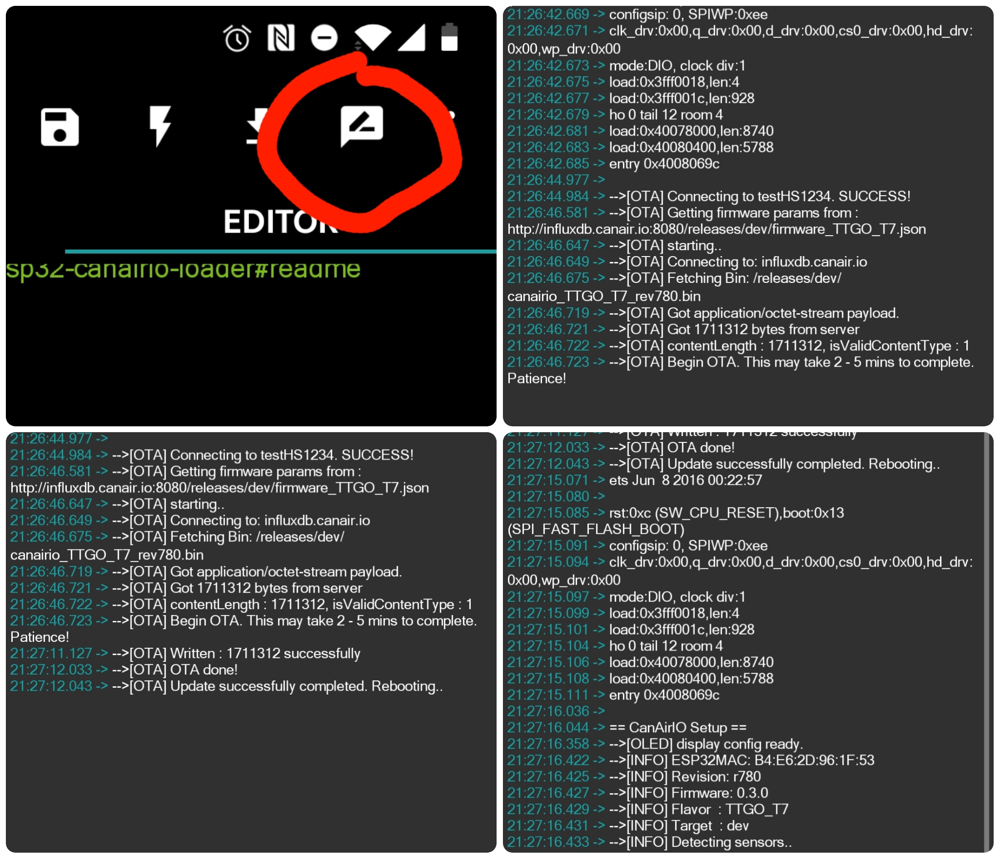
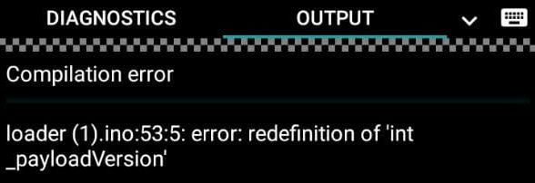

[](https://github.com/hpsaturn/esp32-canairio-loader/actions/)  


# ESP32 CanAirIO Loader

This project will able to upload the latest version of [CanAir.IO firmware](https://github.com/kike-canaries/canairio_firmware#canairio-firmware)
automatically via a simple Arduino sketch.

## General steps

You can run it from your **Arduino IDE** or from your **Android** phone
using [ArduinoDroid](https://play.google.com/store/apps/details?id=name.antonsmirnov.android.arduinodroid2&hl=en&gl=US)
app (**recommended**) with a simple **OTG** cable connected to your board. (see the video below)

- [ ] Install Arduino IDE or Arduino Droid app
- [ ] Install the Arduino Json Library v6.x from ther Library Manager
- [ ] Configure your board: ESP32 Dev Module or similar board
- [ ] Select partion schema to **minimal** ([OTA with 1.9Mb to app 190kbs to SPIFFS](https://codeblog.dotsandbrackets.com/arduino-cli-partition-scheme/))
- [ ] Configure your WiFi credentials in the sketch
- [ ] Build and upload, wait for, the last version of CanAirIO will be installed
- [ ] (optional) see the progress on Serial console or monitor.
- [ ] Android app guide for using the device like a [mobile or fixed air quality station](https://github.com/kike-canaries/canairio_firmware/blob/master/README.md#android-canairio-app)

## Video step by step 

[](http://www.youtube.com/watch?v=FjfGdnTk-rc "Youtube CanAirIO basic loader guide")

---

# Troubleshooting

## Not happen anything after upload

Please view the output messages in the serial monitor, maybe you have internet connection issues, for that:

- Wait for complete upload firmware (i.e 100%)
- Press and hold the reset button 
- Enter to serial monitor (button on top right)
- The serial output in Arduino Droid app for example is similar like this:



- The output in Arduino IDE monitor is the same.

## When I try to compile have errors

For example if you have the next error:



```cpp
loader (1).ino:53:5: error: redefinition of 'int_payloadVersion'
```

maybe you have two or more files open in the IDE, please review the opened tabs:


---

We have a [Telegram group](https://t.me/canairio) for support, maybe the community can help you. (Spanish/English)
